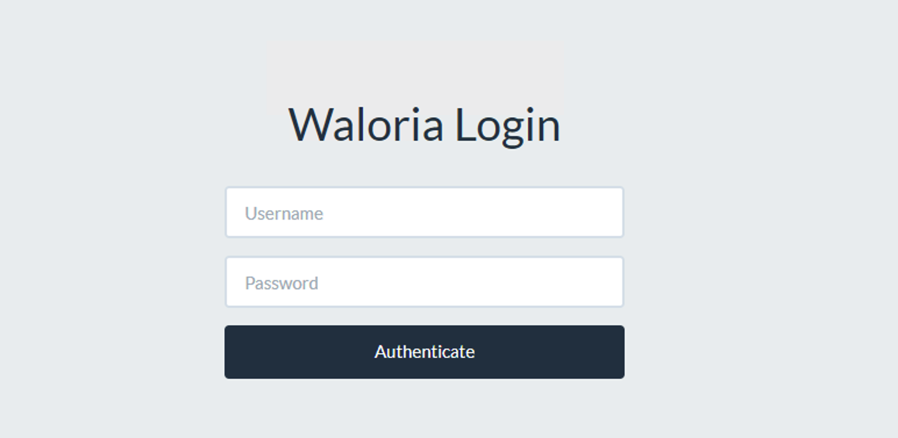

# MMORPG Item Generator

A web-based MMORPG item generator for TrinityCore 3.3.5a written in Ruby (Sinatra) with
SQLite and DataMapper as ORM. Depends on a multitude of Ruby gems and outputs
the completed generation in SQL format.   

Inspired by World of Warcraft's itemization formulas. 

## Features

- User access management and item generation restriction limits.
- Output item information prepared as a SQL insert into statement.
- Single equipment and weapon generation support for when there is a need to generate unique but balanced items.
- Automatic equipment and weapon set generation. Easily create hundreds to thousands of balanced items to disperse into your game.
- Support for tons of options that let you tweak how the generated items ends up. This includes for instance:
    - Even stat distribution modifier (Choose how much of the item's total power should be evenly distributed)
    - Base power modifier (Item Level Modifier)
    - Item quality (Uncommon, Common, Rare, Epic and Legendary)
    - Item bonding (No binding, Bind on pickup, Bind on equip, Bind on use)
    - Display Level (Decides which pool of 3D item models that can be picked)
    - A list of base stats that will always exist on the item (Agillity, Attackpower, Intellect, Spirit, Stamina, Strength, Bonus Healing, Magic Penetration, Mana Per 5 seconds, Spellpower, Haste, Critical Strike Rating and Hit Rating)
    - A list of random stats that could potentionally end up as part of the item.
    - A count of how many random stats that should end up on the item.
- Support to generate item variations, meaning that although one item with one database entry gets created, it could have 500 different item variations in terms of stat distribution that could be picked up by the player.

## Previews

